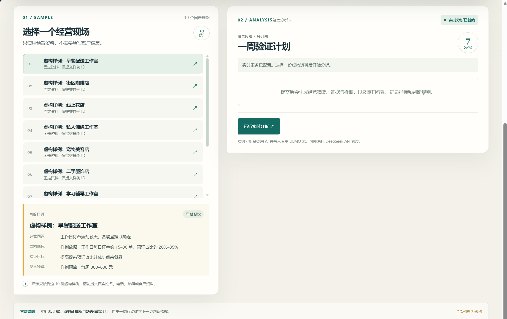
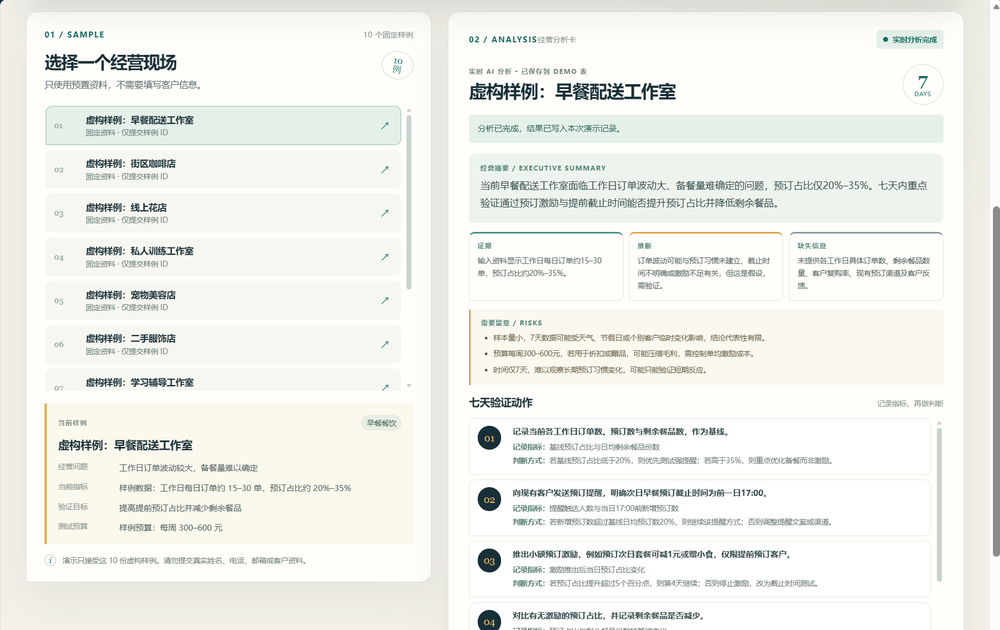
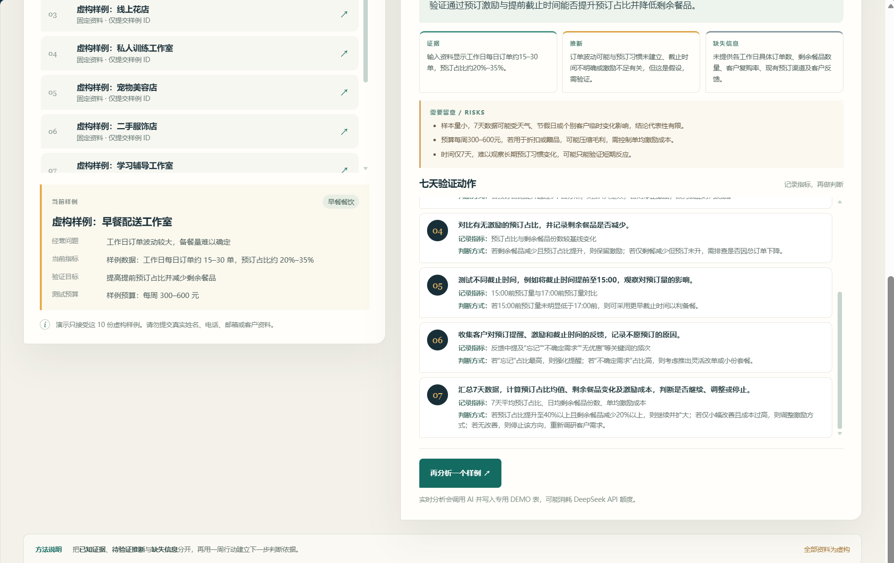
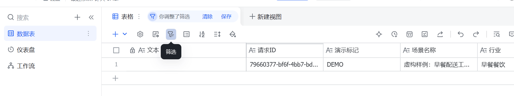
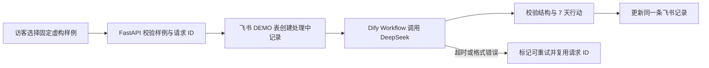

# AI 经营分析与 7 天验证助手

一个面向小微商家的 AI 经营分析演示：选取固定的虚构商家资料，经过 FastAPI → Dify Workflow/DeepSeek → 飞书多维表格，生成经营分析和 7 天可执行验证计划。

项目仓库：[business-validation-lab](https://github.com/Heart727/business-validation-lab)。

公开演示：[经营验证工作台](https://business-validation-lab.vercel.app/)（无需登录，可运行实时分析）。

> **线上已接通真实流程。** 访客选择固定的虚构样例并点击「运行实时分析」，服务端调用 Dify Workflow / DeepSeek，校验结果后写入专用飞书 DEMO 表。2026-10-05 已用匿名访问完成一次提交及同一请求 ID 重试验收。外部服务的额度和可用性会影响后续运行。

选择任一样例可查看其虚构经营问题、当前指标、验证目标与测试预算。每次实时提交根据所选样例生成结果；本地未启用实时模式时，页面仍提供仅对应早餐配送工作室的离线固定预览。

## 截图









离线回退的桌面和手机截图保留在 [docs/screenshots](docs/screenshots/)；它们明确标记为静态预览。

## 它解决什么问题

小商家常凭直觉决定要不要做促销、投广告或调整服务，却缺少一套轻量方法来记录基线、提出可验证的判断、安排下一步。这个演示把一份经营问题整理为证据、推断、缺失信息和 7 天行动，帮助使用者先跑一个小实验，再根据指标决定是否继续。

项目只内置 **10 份虚构**商家资料。公开表单只传固定样例 ID 和请求 ID，不接受访客自由文本、姓名、电话或邮箱；写入的记录标记为 `DEMO`。

## 主要流程



应用通过 Pydantic 校验模型输出：必须有 7 个不同日期（第 1–7 天），观察中分别包含有内容的「证据」「推断」「缺失信息」。Dify 或飞书失败时，公开 API 只返回稳定错误码，不透传上游错误正文或密钥。

## 本地运行

需要 Python 3.12 或更新版本。无需外部账号即可打开 UI、查看离线静态预览并运行完整测试。

```powershell
python -m venv .venv
.\.venv\Scripts\python.exe -m pip install -r requirements.txt
Copy-Item .env.example .env
.\.venv\Scripts\python.exe -m uvicorn index:app --reload
```

浏览器打开 <http://127.0.0.1:8000/>。复制 `.env.example` 后默认 `DEMO_MODE=false`，所以实时提交会被拒绝，固定静态预览仍可浏览。保持该设置就不会调用 Dify 或写入飞书。

## API 与验证

| 路径 | 用途 |
| --- | --- |
| `GET /api/health` | 服务状态及实时演示开关状态 |
| `GET /api/scenarios` | 获取 10 个固定样例的 ID 和标题 |
| `GET /api/preview` | 获取离线固定分析结果 |
| `POST /api/analyze` | 提交已知样例 ID 与 UUID 请求 ID |
| `POST /api/retry` | 使用原请求 ID 恢复同一条失败记录 |

运行自动化测试和无凭证的 10 样例验收：

```powershell
.\.venv\Scripts\python.exe -m pytest -q
.\.venv\Scripts\python.exe scripts\verify_mock_flow.py
```

验收脚本只使用内存假服务，不访问网络、不消耗 DeepSeek 额度、不写入飞书。`node --check static/app.js` 和 `.\.venv\Scripts\python.exe -m compileall -q app index.py scripts` 可用于检查前端语法与 Python 编译。

前端观察归类回归测试使用 Node 内置测试运行器：

```powershell
node --test tests\test_observations.cjs
```

## 配置真实集成

本地实时集成默认关闭，线上公开演示已配置并启用。`.env.example` 只列服务端环境变量名称和安全默认值；本地凭证写在被 Git 忽略的 `.env`，线上凭证只配置在 Vercel 项目环境变量中。不要把 API key 发在聊天、截图、源码、README、浏览器代码或构建日志中。

DeepSeek 凭证配置在 Dify 的模型供应商设置里；Vercel 不需要 `DEEPSEEK_API_KEY`。Dify Workflow API Key 和飞书应用凭证只由 FastAPI 服务端读取。配置指南：

服务端变量名包括 `DIFY_WORKFLOW_API_KEY`、`FEISHU_APP_SECRET`、`FEISHU_APP_ID`、`FEISHU_APP_TOKEN`、`FEISHU_TABLE_ID` 和 `FEISHU_BASE_URL`；在本地 `.env.example` 中查看完整清单。

- [飞书多维表格字段与权限](docs/feishu-table-fields.md)
- [Dify Workflow 与 DeepSeek](docs/dify-workflow.md)
- [失败场景、恢复方式与限制](docs/failure-cases.md)

外部服务可能产生费用或用量消耗：DeepSeek 按账户当前价格计费，Dify 受工作空间额度和套餐限制。维护线上演示时需持续检查用量；如果额度不足，应暂停实时入口。

### 公开演示的保护措施

2026-10-05 启用线上 `DEMO_MODE=true` 前，已完成以下配置：

1. 飞书应用只获得本项目所需的多维表格访问权限，并写入独立演示表；表内只允许虚构样例，禁止复用真实客户数据。
2. Dify Workflow 已发布，DeepSeek 供应商凭证仅保存在 Dify；Workflow 的 API key 保存在 Vercel 服务端环境变量。
3. Vercel WAF 已发布限流规则，只匹配 `/api/analyze`、`/api/retry`，每个来源 IP 每 10 分钟最多 5 次。
4. DeepSeek/Dify 用量与费用已检查。预付费余额和平台额度仍可能耗尽，需持续监测。

规则可用 Vercel Hobby 的 WAF 能力配置；部署时请以账户控制台当前功能与额度为准。参见 [Vercel Firewall 使用说明](https://vercel.com/docs/vercel-firewall/vercel-waf/usage-and-pricing) 和 [Vercel Python Runtime](https://vercel.com/docs/functions/runtimes/python)。函数时限在 [vercel.json](vercel.json) 中保守设为 60 秒。

## 部署

仓库根目录是 Vercel Root Directory。当前已连接 GitHub 并部署到 [正式公开地址](https://business-validation-lab.vercel.app/)；匿名请求首页、静态资源和只读 API 均返回成功，`/api/health` 显示 `live_demo_enabled=true`。已验收一次真实匿名分析、飞书写入和相同请求 ID 重试；这不等于长期可用性保证。本地 `.env.example` 仍保持 `DEMO_MODE=false` 作为安全默认值。

Vercel Python Runtime 文档列出 Python 3.12、3.13、3.14；本地可用版本由本机环境决定。

## 技术栈

Python、FastAPI、Pydantic、HTTPX、原生 HTML/CSS/JavaScript、Dify Workflow、DeepSeek、飞书多维表格、Vercel Functions、pytest。

> 应用本身没有自建 SQLite 持久层；演示记录保存在单独的飞书多维表格。关闭实时模式时，提交接口返回 `demo_disabled`。

## 项目案例

两分钟项目介绍、实现范围和已验证内容见 [docs/case-study.md](docs/case-study.md)。案例页明确区分一次真实线上验收与 10 份样例的本地模拟测试。
