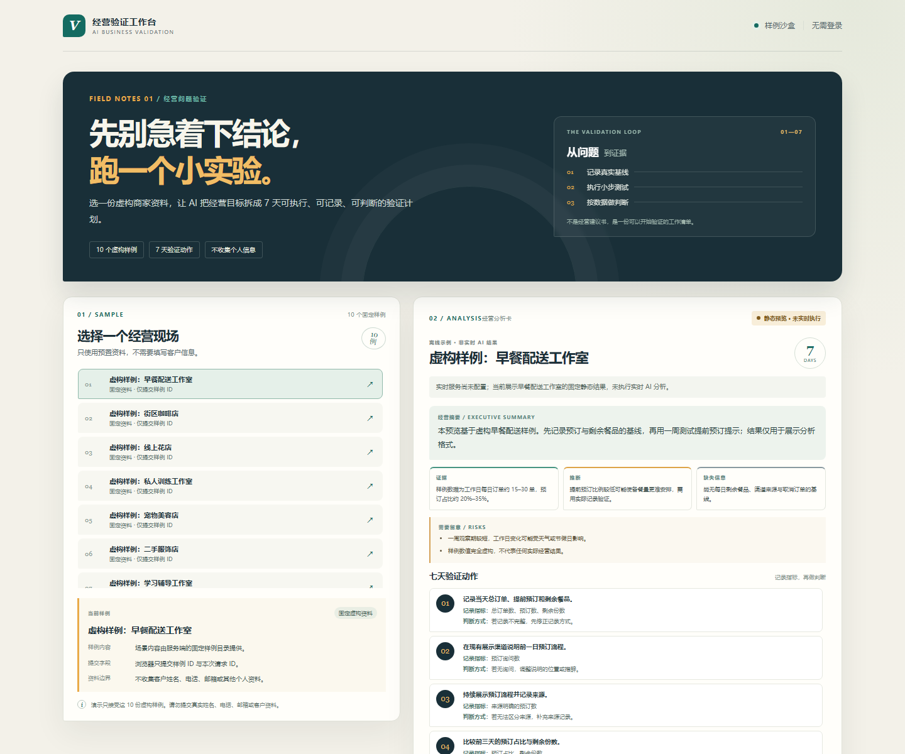
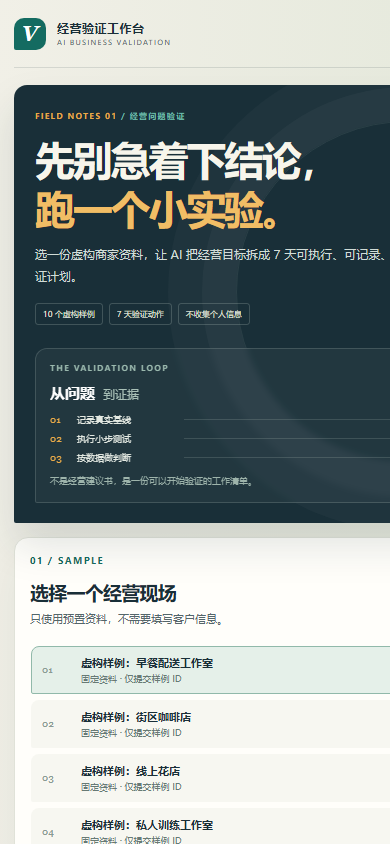

# 项目案例：AI 经营分析与 7 天验证助手

## 需求

小商家会面对“要不要做活动、投放或调整服务”的日常决定，但常常缺少明确基线、验证指标和结束条件。本项目把一个经营问题转成一份有证据边界、风险说明与时间安排的 7 天小实验计划。

## 流程

## 实现与可讲解的工程决策

- FastAPI 同时提供静态页面与 JSON API；公开 API 只接受预置样例 ID，拒绝额外请求字段。
- Pipeline 先找已有请求记录，再创建 `processing` 记录；重试复用同一记录，避免每次失败都制造重复线索。
- AI 结果需要结构化摘要、证据/推断/缺失信息、风险，以及第 1 至第 7 天各一项行动；解析和状态转换失败时不标记完成。
- 外部请求有超时，API 不向访客透出第三方原始响应；客户端使用安全提示与受限重试。
- 本地验收用内存假服务覆盖 10 个样例、超时、格式错误、认证失败、写入失败和重试，不产生网络调用或服务费用。

## 验证

本仓库自动测试覆盖 API、数据校验、集成客户端边界、状态恢复和页面文件；`scripts/verify_mock_flow.py` 通过 10 份样例。静态 UI 在桌面 1440px 与移动端 390px 浏览器窗口核验，并检查无横向溢出及浏览器控制台错误。可复现命令见 [README](../README.md#api-与验证)。

## 部署状态与限制

截图展示的是固定离线静态预览。**实时 AI 实测：未完成；真实飞书写入实测：未完成。** 当前没有接入用户的 Dify、DeepSeek 或飞书账号，线上 `DEMO_MODE` 必须为 `false`。在公开真实调用之前，还需配置服务端凭证、专用虚构演示表、已发布 Workflow 和 Vercel WAF 限流规则，并完成匿名端到端验收。

## 作品演示时可以说明

演示重点是如何把生成式 AI 放在一个可检查的验证流程里：限定输入、先创建可追踪记录、校验结构化输出、明确区分证据与推断，并让失败重试复用同一请求。当前公开交付物证明这些边界和离线体验；不能把静态预览称为已经运行的实时 AI 产品。
