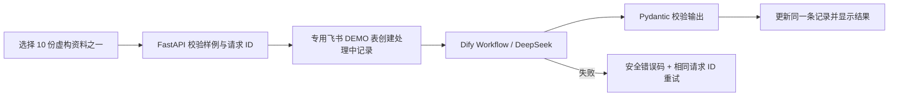

# 项目案例：AI 经营分析与 7 天验证助手

代码：[GitHub 项目仓库](https://github.com/Heart727/business-validation-lab)。

演示：[公开实时演示](https://business-validation-lab.vercel.app/)（无需登录，只使用虚构样例）。

访客选择 10 份虚构资料之一，点击「运行实时分析」，即可看到根据所选经营问题生成的摘要、证据、推断、缺失信息、风险和逐日验证动作。结果同步保存到专用飞书多维表格，记录带 `DEMO` 标记。

## 需求

小商家会面对“要不要做活动、投放或调整服务”的日常决定，但常常缺少明确基线、验证指标和结束条件。本项目把一个经营问题转成一份有证据边界、风险说明与时间安排的 7 天小实验计划。

## 流程

## 实现与工程决策

- FastAPI 同时提供静态页面与 JSON API；公开提交只接受预置样例 ID 和 UUID，不接受额外字段或访客自由文本。
- Pipeline 先按请求 ID 找记录，再创建 `processing` 记录；重试查回并复用同一条，避免失败后重复写入。
- AI 结果必须包含结构化摘要、证据/推断/缺失信息、风险，以及第 1 至第 7 天各一项行动；不合格输出不能标记为完成。
- 外部请求有超时，公开 API 返回稳定错误码，不向访客透出上游响应正文或密钥。
- 线上只接入独立演示表；Vercel WAF 对两个写入端点按来源 IP 限制为每 10 分钟 5 次。预付费余额、Dify 配额和分布式来源仍需运营者监控。

## 验证证据

2026-10-05，匿名调用线上 API 提交早餐配送工作室虚构样例，`POST /api/analyze` 返回 `completed`；用相同请求 ID 调用 `POST /api/retry`，返回同一份结果，没有创建第二条记录。返回结果包含 7 天行动和证据/推断/缺失信息，飞书 DEMO 表出现对应记录。Dify 的已发布 Workflow API 也单独完成过一次真实运行。2026-10-06，再从公开网页点击按钮完成一次实时分析，页面显示已保存的结果与第 1–7 天动作；下面的截图来自这次浏览器运行及飞书记录视图。

本地自动化包含 176 项 Python 测试；`scripts/verify_mock_flow.py` 使用内存假服务跑通 10 份虚构样例，并覆盖超时、无效输出、鉴权/读写错误及重试。10 样例验收**不消耗模型额度，也不等于 10 次真实 DeepSeek 调用**。命令见 [README](../README.md#api-与验证)。

1. 公开页面选择虚构样例：

   

2. 实时结果中的摘要与观察：

   

3. 结果中的逐日行动：

   

4. 对应的飞书 DEMO 记录：

   

离线模式和手机端的旧截图保留在 `screenshots/static-preview-*.png`，图中的「静态预览」标记仅适用于本地未启用实时模式的回退体验。

## 限制

只接受预置的 10 份虚构资料，不处理真实客户信息，也不是通用商业咨询服务。AI 输出是待验证的经营假设，不保证收益。公开实时模式受 DeepSeek 余额、Dify 额度、飞书可用性和 Vercel 函数时限影响；WAF 是每 IP 限流，无法单独防御所有分布式滥用。站点提供离线静态回退，便于外部服务暂停时仍能看懂项目流程。
